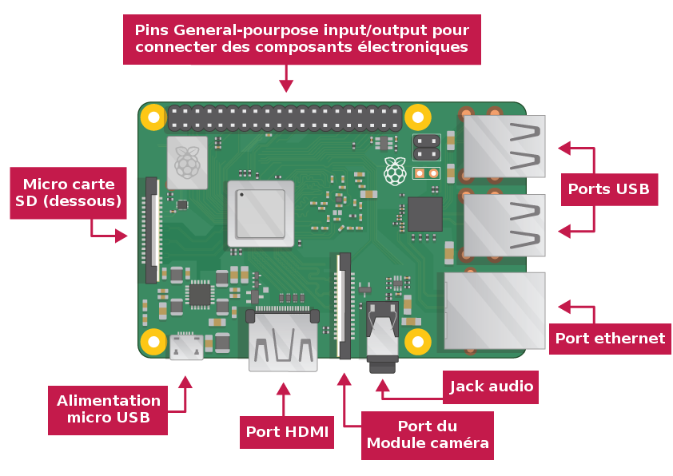

(Raspberry_Pi)=
# Raspberry Pi: Prise en main et préparation

Cette fiche vise à prendre en main le Raspberry Pi, et à le préparer pour les activités MarsCamBot. 


## Prise en main

Si vous n'avez jamais utilisé de Raspberry Pi, nous vous recommandons de commencer par suivre l'activité [Premiers pas avec le Raspberry Pi](https://projects.raspberrypi.org/fr-FR/projects/raspberry-pi-getting-started/0) de la fondation Raspberry. Un schéma d'un Raspberry 4 est donnée ci-dessous:

 

L'activité 'Premiers pas avec le Raspberry Pi' vous permettra de:

* Faire connaissance avec le Raspberry Pi (RPi)
* Installer la carte SD, puis connecter un écran, claivier et souris au RPi
* Configurer la langue, le fuseau horaire, et optionnellement le Wifi
* Explorer quelques uns des logiciels préinstallés (éditeur de texte, navigateur Web, etc...).


## Connexion depuis un autre ordinateur

Il est souvent pratique d'utiliser le RPi à 'distance', c'est-à-dire en s'y connectant par le réseau depuis un autre ordinateur ou tablette. 

Le moyen le plus simple pour une connexion à distance est d'utiliser le logiciel [VNC viewer](https://www.realvnc.com/fr/connect/download/viewer/). Télécharger-le, puis installer-le sur l'ordinateur ou la tablette à partir de laquelle vous souhaitez vous connecter au RPi. Vous devrez d'autre part configurer le RPi pour être accéder par VNC viewer, et obtenir l'adresse IP du RPi pour la connexion. 

[Suivez le guide proposé ici](https://www.gotronic.fr/blog/guides/vnc/) pour les différentes étapes à suivre.

La capture d'écran ci-dessous montre l'interface VNC connectée à un RPi (version AstroPi de l'ESA):

 


* Voir https://www.ionos.fr/digitalguide/serveur/configuration/mise-en-place-dun-vnc-sur-raspberry-pi/
* Client pour Mac: https://www.tweaking4all.com/os-tips-and-tricks/macosx-tips-and-tricks/best-vnc-client-macos-x/

## Installation des logiciels


### Copie du dépôt

```
git clone https://github.com/lascientotheque/ai-rover-fr
```

 

### Jupyter notebook


Preference - Add/Remove software - Jupyter interactive notebook

### ImageMagick

Preference - Add/Remove software - Imagemagick from software (image manipulation program - binaries)

```
picture_as_image_object.show()
see https://forums.raspberrypi.com/viewtopic.php?t=257776

```

### OpenCV

```
sudo pip install opencv-contrib-python
```

-> opencv-contrib-python-4.5.4.60

Prend environ 2 ou 3 heures pour s'installer. 

## Resources utiles

* [https://github.com/CamJam-EduKit/EduKit3 - Introduction.pdf](https://github.com/CamJam-EduKit/EduKit3/blob/master/CamJam%20Edukit%203%20-%20GPIO%20Zero/CamJam%20EduKit%203%20-%20Robotics%20Worksheet%201%20(GPIO%20Zero)%20-%20Introduction.pdf)
* [Robot building](https://raw.githubusercontent.com/CamJam-EduKit/EduKit3/master/CamJam%20Edukit%203%20-%20GPIO%20Zero/CamJam%20EduKit%203%20-%20Robotics%20Worksheet%202%20(GPIO%20Zero)%20-%20Building%20a%20Robot.pdf)
* [Raspberry Pi Getting Started](https://projects.raspberrypi.org/fr-FR/projects/raspberry-pi-getting-started)


