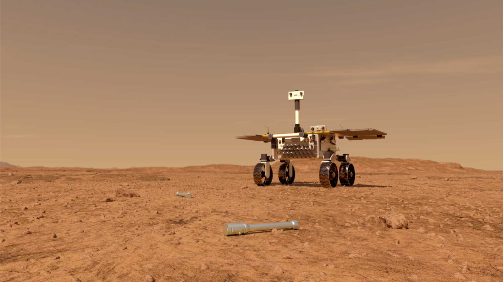

# MarsCamBot: Rover martien intelligent  

Construis un rover martien avec une carte Raspberry Pi et programme-le avec des techniques d'intelligence artificielle de reconnaissance d'images pour aller rechercher de précieux tubes sur Mars!

<h4>Inspiration: Le rover martien Fetch à la recherche des tubes laissés sur mars en 2022 par le rover Perseverance - <a href="https://mars.nasa.gov/resources/24761/fetch-rover-approaching-sample-tubes-artists-concept/">Vue d'artiste</a>:</h4> 

</img>

## Public ciblé

* A partir de **10 ans** pour les activités de reconnaissance d'images, construction du robot, et **programmation en Scratch**.
* A partir de **14 ans** pour les activités de reconnaissance d'images, construction du robot, et **programmation en Python**.

## Guide des activités

[https://lascientotheque.github.io/fetchbot-fr/Overview.html](https://lascientotheque.github.io/fetchbot-fr/Overview.html)

